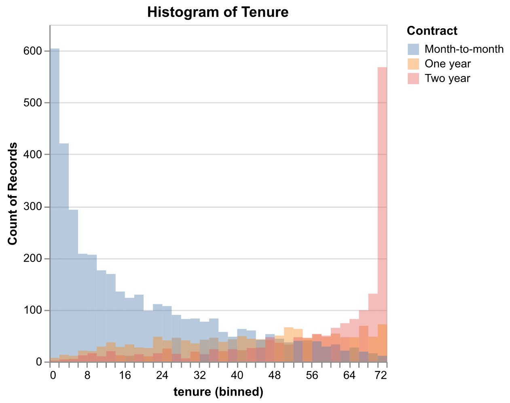
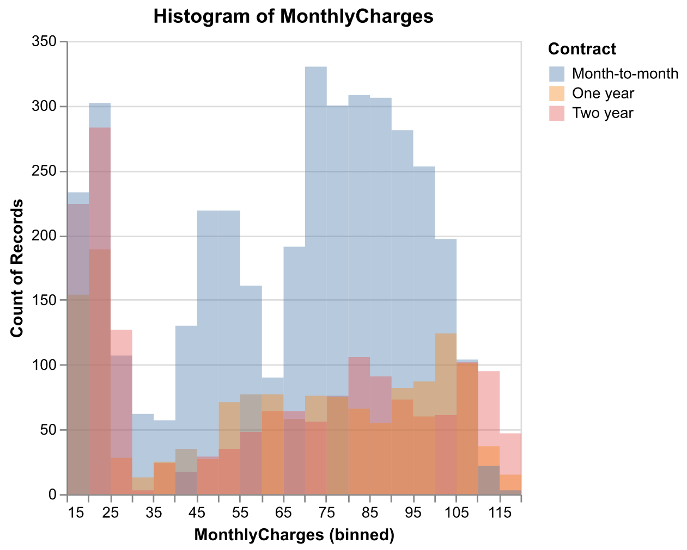
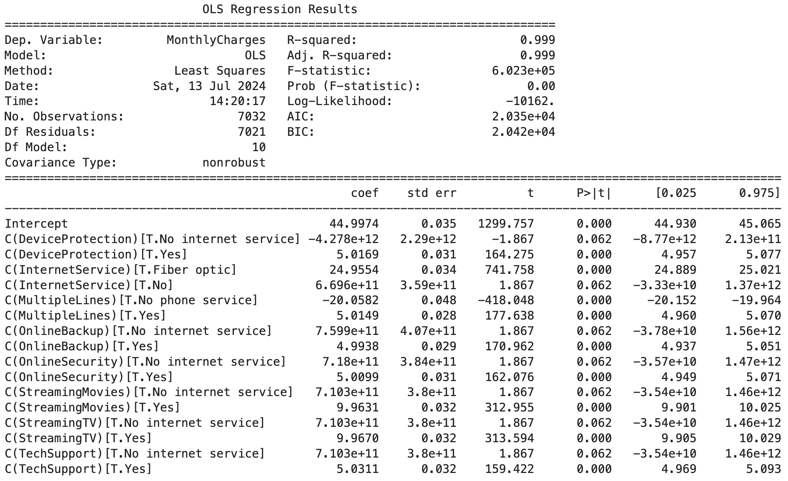
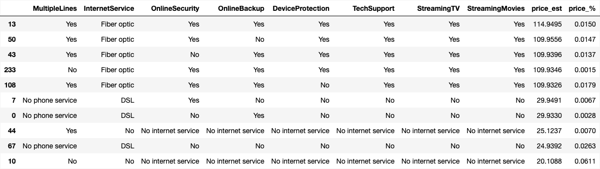
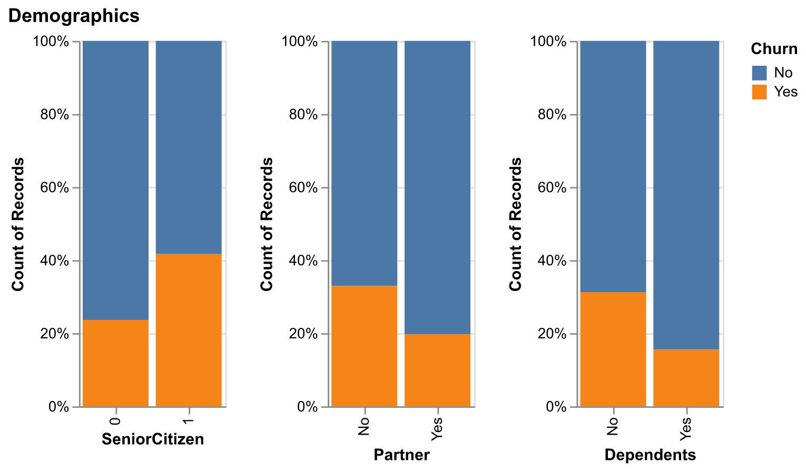
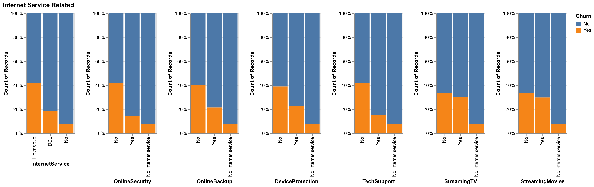
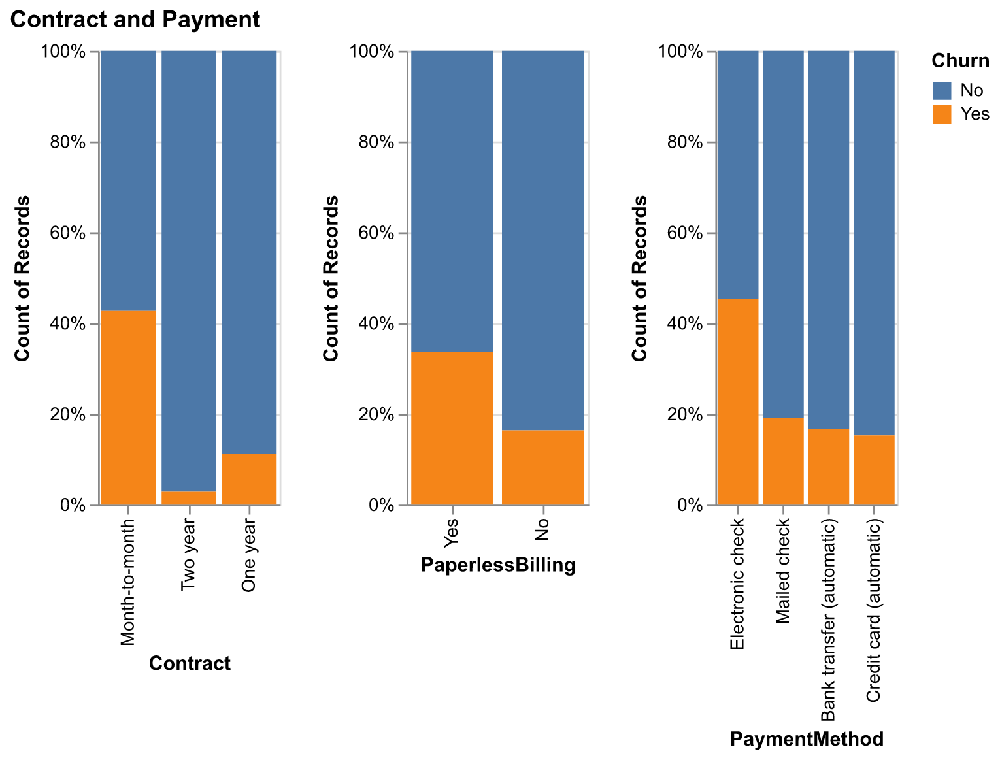

# Customer Churn Analysis and Prediction

Customer churn is the rate at which customers stop using a company's products or services. By using advanced analytics and machine learning, businesses can predict which customers are likely to leave, enabling proactive retention strategies. This approach enhances customer loyalty and lifetime value, increasing revenue and providing a competitive advantage.

The dataset is provided by IBM on [Kaggle](https://www.kaggle.com/datasets/blastchar/telco-customer-churn). The dataset includes information about:

- Outcome Variable
    * Customers who left within the last month. (Outcome Variable)
- Features
    * Demographic info about customers – gender, age range, and if they have partners and dependents
    * Services that each customer has signed up for – phone, multiple lines, internet, online security, online backup, device protection, tech support, and streaming TV and movies
    * Customer account information – how long they’ve been a customer, contract, payment method, paperless billing, monthly charges, and total charges

## Exploratory Data Analysis

- Different contract types do show different distributions of tenure.
- Tenure is short for monthly contracts, but relatively high for two-year contracts. 

&nbsp;

- Monthly charges appear to be uncorrelated with contract type, especially for charges under $30, as they share similar fees across contract types. 
- There are other factors affecting the monthly fees. We conduct additional regression analysis to investigate the relationship.

### Monthly Charges Analysis
- Conduct regression analysis on the monthly charges. (ANCOVA)
- We consider MonthlyCharges as the dependent variable and other Services related features as independent variables.

- The model expalins 99.9% variance on the means of monthly charges. ($R^2=0.999$)
- The model shows how Telco charges for each service. Therefore, we can list the charging fees corresponding to each combination of services.
- The MAPE of the estimations is 1.22%.

### Churn Analysis

- Senior citizen, people without partner and people without dependents are less likely to churn.

&nbsp;

- For internet service, people choosing Fiber optic have the highest churn rate.
- There are 4 additional service including online security, online backup, device protection and tech support sharing similar patterns. People adopting these service are less likely to churn (Yes vs. No), indicating their engagements.
- In addition, streaming TV and streaming movies are also related to internet service. But it seems these services may not satisfy customers a lot.

&nbsp;

- The contract types do reflect user engagements. Month-to-month subscription users tend to leave Telco apparently.
- As for payment method, electronic check has the highest churn rate. People are more aware of how much they paid and perhaps think the service renewal twice.

## Feature Engineering

To measure user engagement, we can consider different dimensions: depth and breadth.
- Depth:
    * Which contract type the user chose?
    * How many times they have subscribed? (`tenure // month of contract`)
    * How many months are left until the next time renewal? (`tenure % month of contract`) 
- Breadth:
    * How many additional services they subscribed?
    * What's average price they'll pay for each service? (Cost Performance Index)

## Model Selection
- Use 5-fold cross-validation to evaluate different models.
- The performance are evaluated by accuracy and recall.

|                     |   fit_time |   score_time |   accuracy |   recall |
|:--------------------|-----------:|-------------:|-----------:|---------:|
| Naive Bayes         |       0    |         0    |       0.68 |     0.86 |
| Neural Net          |       0.25 |         0    |       0.77 |     0.58 |
| Logistic Regression |       2.49 |         0    |       0.8  |     0.55 |
| AdaBoost            |       0.19 |         0.01 |       0.8  |     0.52 |
| Decision Tree       |       0.03 |         0    |       0.73 |     0.49 |
| Random Forest       |       0.38 |         0.02 |       0.79 |     0.49 |
| Nearest Neighbors   |       0    |         0.1  |       0.77 |     0.49 |
| RBF SVM             |       0.77 |         0.74 |       0.74 |     0.04 |

- For customer churn, **recall** may be an important metric, since we want to increase the retention rate and take care of people who are likely to churn.
- Since recall and precision have a trade-off relationship, the precision is somewhat low. This indicates that the model is more conservative.
- Whether we use the entire dataset or select stratified data (table showed in .ipynb) for CV, Naive Bayes consistently shows higher recall.
- Therefore, we choose **Naive Bayes** model to conduct predictions. 85% recall is relatively high compared to other models.

## Use Naive Bayes to Investigate Features
### Gaussian NB

| Feature (Partial)    | Fit Time | Score Time | Accuracy | Recall |
|----------------------|----------|------------|----------|--------|
| Contract_Two year    | 0.0      | 0.0        | 0.49     | 0.97   |
| subscription_left    | 0.0      | 0.0        | 0.64     | 0.53   |
| cp                   | 0.0      | 0.0        | 0.76     | 0.28   |
| SeniorCitizen_1      | 0.0      | 0.0        | 0.71     | 0.26   |
| tenure               | 0.0      | 0.0        | 0.74     | 0.00   |
| MonthlyCharges       | 0.0      | 0.0        | 0.74     | 0.00   |

- Since NB is based on the conditional independence assumption of features, we build GaussianNB for each feature. The important features will contribute to the evaluation metric (Recall here).
- `Contract_Two year`, `subscription_left`, `cp`, `SeniorCitizen_1` are four important features.

## Feature Selection based on CV
- After model selection, we find that Naive Bayes is better.
- After investigating feature importance, there are four important features.
- Thus, we can consider how those features contribute to the model.
  
| Feature                 | Fit Time | Score Time | Accuracy | Recall |
|-------------------------|----------|------------|----------|--------|
| Contract_Two year       | 0.001    | 0.001      | 0.491    | 0.973  |
| + subscription_left     | 0.001    | 0.001      | 0.569    | 0.925  |
| + cp                    | 0.001    | 0.001      | 0.598    | 0.919  |
| + SeniorCitizen_1       | 0.001    | 0.001      | 0.670    | 0.853  |
| All features            | 0.003    | 0.002      | 0.680    | 0.853  |

- As more features add, it seems like a trade-off relationship between accuracy and recall.

## Prediction and Recommendation

- Use the whole dataset to retrain the model.

| Feature               | Accuracy | Recall |
|-----------------------|----------|--------|
| Contract_Two year     | 0.503    | 0.984  |
| + subscription_left     | 0.589    | 0.922  |
| + cp                    | 0.611    | 0.896  |
| + SeniorCitizen_1       | 0.669    | 0.839  |
| All Features          | 0.680    | 0.860  |
| Baseline model  (Random Forest)   |    0.79        |         0.48   |

- The model's performance on the test dataset, with an 98.4% recall, is similar to that on the CV dataset.
- With adopting features `Contract_Two year` and `subscription_left`, accuracy increases 8.7% and recall declines by 6.2%.
- Telco should focus on customers with a high probability of leaving. They can provide promotions or coupons, or directly keep track of their activities.
- Identifying potential churn customers may increase the retention rate, consequently enhancing the corresponding customer lifetime value.
- If we can implement **differentiated pricing strategies** based on contract type, it may encourage customers to subscribe to long-term plans, thereby increasing customer lifetime value.
